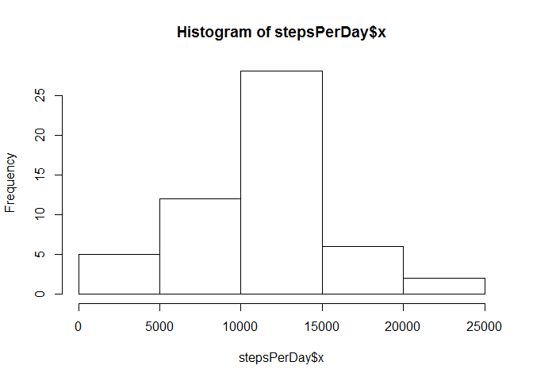
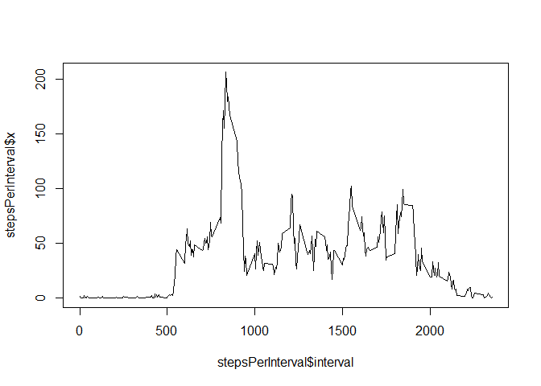
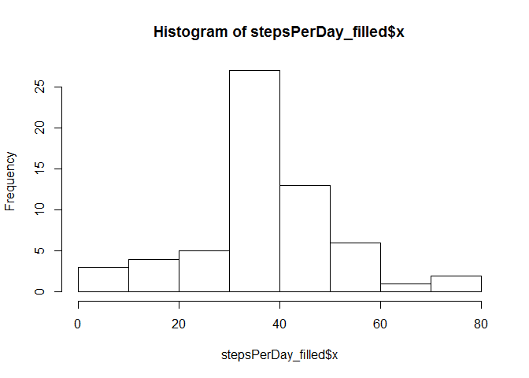
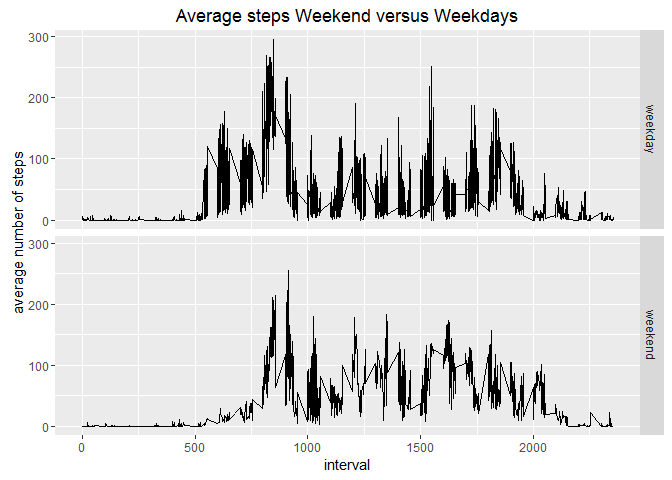

# Reproducible Research: Peer Assessment 1
Christel Veefkind  
27 juli 2016  


## Loading and preprocessing the data


```r
  library(ggplot2)
  setwd("~/Coursera/RepData")
  activity <- read.csv("activity.csv")
```

## What is mean total number of steps taken per day?

```r
      sum(activity$steps,na.rm =TRUE)
```

```
## [1] 570608
```
## Histogram of total number of steps taken per day


```r
      stepsPerDay <- aggregate(activity$steps, list(date = activity$date),sum)
      hist(stepsPerDay$x)
```

<!-- -->

## Mean and Median of the total number of steps taken per day

```r
      summary(stepsPerDay$x)
```

```
##    Min. 1st Qu.  Median    Mean 3rd Qu.    Max.    NA's 
##      41    8841   10760   10770   13290   21190       8
```
## Average daily activity pattern


```r
      stepsPerInterval <- aggregate(activity$steps, list(interval = activity$interval),mean, na.rm = TRUE)
      plot(stepsPerInterval$interval, stepsPerInterval$x, type = "l")
```

<!-- -->

```r
      IntervalHighestSteps <- subset(stepsPerInterval, x == max(stepsPerInterval$x), select = interval)
      View(IntervalHighestSteps)
```
## Missing values
 


```r
      na_steps <- activity[rowSums(is.na(activity)) > 0,]
      nrow(na_steps)
```

```
## [1] 2304
```

```r
    ### Filling in missing values with average per interval
      activity_filled <- activity
      activity_filled$steps[is.na(activity_filled$steps)] <- round(stepsPerInterval$x)
    ###  Steps per day with NA values filled with the mean per interval
      stepsPerDay_filled <- aggregate(activity_filled$steps, list(date = activity_filled$date),mean)
      hist(stepsPerDay_filled$x)
```

<!-- -->

```r
      summary(stepsPerDay_filled$x)
```

```
##    Min. 1st Qu.  Median    Mean 3rd Qu.    Max. 
##  0.1424 34.0900 37.3700 37.3800 44.4800 73.5900
```
There is no difference in mean and median

## Are there differences in activity patterns between weekdays and weekends?


```r
      activity_filled$day <- weekdays(as.Date(activity_filled$date))
      activity_filled_grouped <- aggregate(activity_filled$steps, by=list(activity_filled$interval, activity_filled$day), FUN=mean)
      activity_filled_grouped$dayType <- "weekday"
      activity_filled_grouped$dayType[activity_filled_grouped$Group.2 %in% c("zaterdag","zondag")] <- "weekend"
      activity_filled_grouped$dayType <- as.factor(activity_filled_grouped$dayType)
        qplot(Group.1,x , data = activity_filled_grouped, 
        geom = "line",
        xlab =  "interval",
        ylab =  "average number of steps",
        main = "Average steps Weekend versus Weekdays",
        facets =dayType ~.)
```

<!-- -->
